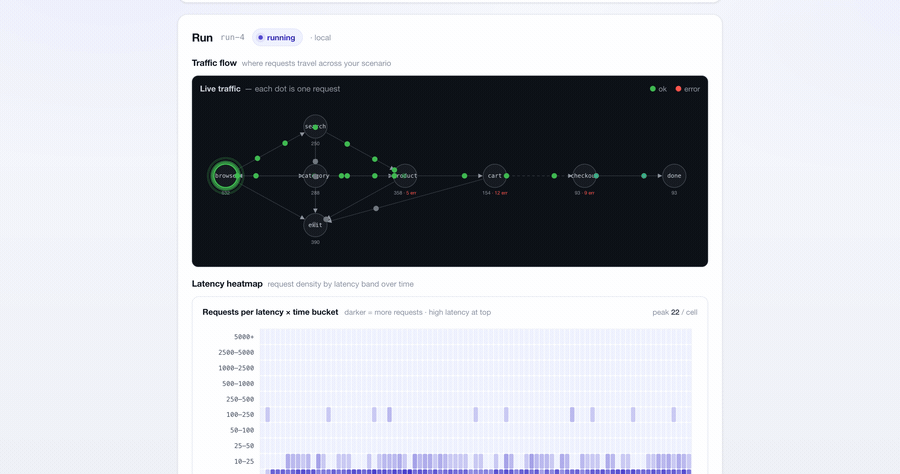

<h1 align="center">tmula</h1>

<p align="center">
  <b>
    부하를 받을 때 사용자 흐름이 어디서 먼저 깨지는지 봅니다 -
    액세스 로그를 넣으면 그 여정을 대신 학습합니다.
  </b><br>
  tmula는 실제 트래픽을 명시적인 <i>행동 그래프</i>로 만들고, 그 위에서 가상 사용자를
  실행합니다 - 분기하고, 망설이고, 때로는 경로를 벗어나고, 단일 엔드포인트로 몰립니다.
  그리고 무언가 실패했다는 사실만이 아니라 <i>여정의 어디서</i> 실패했는지, 그게
  <i>부하 탓인지 진짜 버그인지</i>까지 알려줍니다.
</p>

<p align="center">
  🌐 <b>README</b>:
  <a href="README.md">English</a> · <a href="README.ko.md">한국어</a><br>
  📖 <b>사용자 매뉴얼</b>:
  <a href="docs/guide.en.md">English</a> · <a href="docs/guide.ko.md">한국어</a>
</p>

<p align="center">
  
  <br>
  <sub><i>
    라이브 실행 중인 웹 콘솔 - 행동 그래프 위로 요청이 지나가고
    지연 시간 히트맵이 채워집니다.
  </i></sub>
</p>

---

## tmula란?

대부분의 부하 도구는 "초당 몇 요청까지 버티는가?"에 답합니다. tmula는 다른 질문에 답합니다.
**사용자가 실제로 움직이는 대로 트래픽이 흐를 때, 그 흐름은 어디서 먼저 깨지는가 - 그리고 그
실패는 부하 탓인가, 진짜 버그인가?**

가장 빠른 입구는 액세스 로그입니다. 로그를 넘기면 tmula가 사용자 여정을 대신 학습합니다 -
어떤 엔드포인트 다음에 어떤 엔드포인트가 오는지, 얼마나 자주, 얼마나 빠르게 - 명시적인
**행동 그래프**(노드 = API 호출, 가중치 엣지 = 전이, 절대 건너뛰지 않는 의존 엣지)로요.
(로그가 없다면 OpenAPI 스펙이나 HAR에서 그래프를 만들거나 직접 그려도 됩니다.) 그다음 그
그래프 위로 가상 트래픽을 보내 흐름이 어디서 느려지고, 실패하고, 몰리는지 관찰합니다.

가상 사용자는 여정을 따라가고, 분기하고, 망설이고, 때로는 시나리오를 벗어나며, 많이 쓰는
엔드포인트로 몰립니다. 문제는 세 가지 모드로 드러납니다.

- **시나리오 따라가기** - 현실적이고 분기하는 트래픽 아래에서 정상 경로가 버티는지 확인합니다.
- **이탈** - 단계마다 설정한 확률로 사용자가 시나리오를 벗어납니다. 여정을 중간에 포기하거나
  낮은 확률의 전이를 탐색하되, 의존 관계는 절대 위반하지 않습니다.
- **부하 집중** - 실행 전체를 단일 엔드포인트로 보내거나(`tmula run --get /path`), 오픈 모델
  도착률을 순간적으로 높여 어디서 성능이 떨어지는지 봅니다.

흐름이 실제로 깨지면, tmula는 숫자에서 멈추지 않습니다. 실패한 세션을 부하 없이 단독으로
재현해 **부하 의존** 실패와 **기능 버그**를 구분하고, 이전 런과 비교하는 베이스라인 게이트로
CI가 *새로 생긴* finding만 막게 합니다.

생성되는 트래픽은 학습한 분포를 그대로 재생하는 것이 아니라, 그 분포의 **의존 관계를 지키는
근사**입니다. walker는 매 단계에서 학습한 가중치를 *진입 가능한*(의존 관계가 이미 충족된) 다음
단계들만으로 다시 정규화하고, 노드 상한은 드문 엔드포인트를 접어 전이를 이어 붙입니다. 여정의
형태는 보존하되 필수 선행 조건(장바구니 없이 결제 없음)은 항상 지키는, tmula가 의도적으로 택한
절충입니다.

페이로드 변형, 단계 재정렬, 시간 패턴이 있는 집중 프로파일은 만들어져 있지만 아직
실제 실행에서는 사용되지 않습니다. 자세한 내용은 [로드맵](#로드맵)을 참고하세요.

관찰은 **클라이언트 측 데이터가 우선**입니다. 상태 코드, 지연 시간 꼬리, 오류, 가용성,
`contract` finding을 서버 계측 없이 수집하고, 서버 측 메트릭은 선택 사항입니다. tmula는 웹 콘솔이
내장된 단일 Go 바이너리로 **로컬에서 먼저** 실행하고, 큰 트래픽이 필요하면 분산 마스터/워커 모드로
확장합니다.

tmula는 검증된 부하 테스트 도구를 **대체하려는 도구가 아닙니다**. k6, Locust, JMeter, Gatling,
Artillery, nGrinder는 스크립팅, 분산 실행, 대시보드, CI를 훨씬 깊이 지원합니다. tmula는 위의 더
좁은 관점에서 시작하고, 같은 토대 위에 기댑니다.

---

## 빠른 시작

요구 사항: macOS / Linux. 소스에서 빌드하려면 Go 1.25+와 Node 20+가 필요합니다.

**가장 빠른 방법 - 한 줄로 설치하고, 한 명령으로 실행하고, 약 3분 안에 실제 finding을 봅니다.**

```bash
curl -fsSL https://raw.githubusercontent.com/chordpli/tmula/main/install.sh | sh
tmula demo
```

`tmula demo`는 설정 파일이나 두 번째 터미널 없이 전체 흐름을 자동으로 실행합니다.

1. cart가 가끔 실패하고, checkout은 부하가 걸리면 느려지며, product 링크가 드물게 깨지는
   작은 shop API를 임시 로컬 포트에 띄웁니다.
2. shop 액세스 로그에서 행동 그래프를 **학습**합니다.
3. 엔진 + 웹 콘솔(기본 `:8080`, `--addr`로 변경)을 시작하고, 브라우저를 실행 중인
   라이브 뷰(`/?run=<run-id>`)로 바로 엽니다. 학습된 트래픽은 `--duration` 동안(기본 60초)
   shop으로 다시 보내집니다.
4. finding 요약과 다음 단계를 출력합니다. 여기에는 finding을 단독으로 확인하는
   `tmula reproduce` 명령, HTML 리포트 URL, 같은 루프를 내 서비스에 적용하는
   `tmula init` / `tmula run` 조합이 포함됩니다.

Ctrl-C를 누를 때까지 서버는 살아 있으므로 링크와 명령이 계속 동작합니다. `--no-browser`는
콘솔 자동 열기를 건너뜁니다.

> 브라우저 콘솔 페이지는 UI가 내장된 바이너리가 필요합니다. 설치 스크립트의 미리 빌드된 바이너리와
> Docker 이미지는 UI를 포함합니다. 일반 `go build`로도 데모는 끝까지 동작하지만, 결과는
> 터미널 요약과 `report.html` 링크로 확인합니다.

**Docker로 실행** - Go/Node 설치나 바이너리 설치가 필요 없습니다. 한 명령으로 콘솔(실제 UI
내장)과 의도적으로 버그를 넣어 둔 두 예제 API를 함께 띄웁니다.

```bash
git clone https://github.com/chordpli/tmula.git && cd tmula
docker compose up                # 첫 실행은 빌드한 뒤 모든 서비스를 시작합니다
```

<http://localhost:8080>을 열고 **shop** 또는 **ticketing** 프리셋을 고른 다음, 함께 제공되는 API를
대상으로 지정합니다. **Base URL**은 shop이면 `http://sample-api:9000`, ticketing이면
`http://ticketing-api:9100`으로 두고, **Allowlist**에도 같은 호스트(`sample-api` /
`ticketing-api`)를 추가한 뒤 **Run**을 누르세요. Compose 네트워크 안에서 엔진은 테스트 대상을
`localhost`가 아니라 서비스 이름으로 찾기 때문에 두 필드 모두 서비스 이름을 씁니다.

**실제 서비스에 적용** - 같은 설치 바이너리로 콘솔을 띄우거나 시나리오를 실행합니다.

```bash
tmula --role local --addr :8080      # http://localhost:8080 열기
tmula run scenario.yaml              # 시나리오 실행 후 finding 출력
```

**소스에서 빌드** - Go + Node 필요:

```bash
git clone https://github.com/chordpli/tmula.git && cd tmula
make demo                        # UI + 엔진 + 두 예제 API를 로컬에서 함께 실행
make web                         # 콘솔만 :8080에서 실행
# CLI만 빠르게 빌드(플레이스홀더 UI): make build
```

`make demo`에서는 프리셋을 그대로 쓸 수 있습니다. 함께 제공되는 shop과 ticketing API가
`localhost:9000` / `:9100`에서 뜨기 때문입니다. Ctrl-C로 세 프로세스를 모두 멈춥니다.

처음부터 끝까지 읽을 수 있는 데모 스크립트를 원한다면 [`examples/run-demo.sh`](examples/)를
보세요. `tmula demo`를 직접 따라 해 보는 버전이며 curl/jq 호출을 명시적으로 사용합니다(`go`, `jq`, `curl`
필요). 전체 실습은 [`examples/`](examples/)에 있습니다.

---

## 가상 사용자가 움직이는 방식

| 기능 | 동작 | 상태 |
|------|------|------|
| **시나리오 따라가기** | 엣지 가중치에 따라 그래프를 걷고 의존 엣지를 지킵니다 | ✅ 동작 |
| **이탈** | `deviationRate`로 경로를 벗어나되 의존 관계는 지킵니다 | ✅ 동작 |
| **부하 집중** | 단일 엔드포인트 실행이나 오픈 도착률 스파이크로 부하를 모읍니다 | ✅ 동작 |
| **생각 시간** | 사용자 단계 사이에 무작위 대기 시간을 둡니다 | ✅ 동작 |
| **Finding 임계값** | `findings` 블록으로 오류율, p95, 가용성 기준을 조정합니다 | ✅ 동작 |
| **페이로드 변형** | 요청 본문을 바꿔 입력 검증 버그를 찾습니다 | 🚧 [로드맵](#로드맵) |
| **단계 재정렬** | 허용된 단계를 스크립트 순서와 다르게 방문합니다 | 🚧 [로드맵](#로드맵) |
| **집중 프로파일** | 한 그래프 노드에 시간 패턴이 있는 동시성을 집중합니다 | 🚧 [로드맵](#로드맵) |

가상 사용자는 두 가지 워크로드 모델로 생성됩니다. **클로즈드**는 반복하는 고정 사용자 풀이고,
**오픈**은 시간에 따라 사용자가 도착하는 모델입니다. 오픈 모델은 현실적인 기본값이며 선택적으로
페르소나 믹스를 가질 수 있습니다. 안전 장치(호스트 **allowlist**, **rate cap**, **kill switch**)는
실행이 대상 밖으로 벗어나지 않도록 막습니다.

---

## 응답 데이터 재사용

나중 단계는 앞 단계의 응답 값을 재사용할 수 있습니다. 요청을 가진 step 또는 API 템플릿에
`extract` 맵을 추가하세요. 키는 세션 변수가 되고, 값은 응답 본문 안의 JSON path입니다.
이 변수는 이후 `path`, `headers`, `payloadTemplate`에서 Go template 문법으로 사용할 수 있습니다.

```yaml
target: http://localhost:9000
flow:
  - id: products
    request: GET /products
    extract:
      productId: items.0.id
  - id: cart
    request: POST /cart
    body: '{"productId":"{{.productId}}","qty":1}'
```

각 가상 사용자/세션은 자신이 `extract`로 뽑은 변수만 가집니다. 한 사용자의 product/cart ID가 다른
사용자의 여정에 섞이지 않습니다.

---

## 근거를 함께 보여주는 finding

Finding은 이제 한 줄 요약만이 아닙니다. 엔드포인트별 finding에는 **근거 자료**가 포함됩니다.
여기에는 최대 5개의 대표 실패 세션(가장 먼저 발생한 실패들과 나머지 중 가장 느린 실패), 각
세션 ID(서버 로그에서 찾을 `X-Tmula-Session-ID` 헤더 값), **시드 좌표**(run seed와 user index로
계산하는 session seed), 페르소나, 실패까지 걸어간 그래프 경로, 상태 코드 분포, 실행 시간 안에서의
발생 분포가 포함됩니다. 웹 콘솔과 HTML 리포트는 이를 finding별로 펼쳐 볼 수 있는 패널에서 보여줍니다.

**재현 - 진짜 버그인가, 부하 때문에 생긴 문제인가?** 시드 좌표 덕분에 finding은 재실행할 수 있습니다.
`tmula reproduce`는 대표 실패 세션 하나를 동시 부하 없이 단독으로 다시 실행하고, 실패가 얼마나
재현되는지로 원인을 분류합니다.

```bash
tmula reproduce --engine http://localhost:8080 --run run-12 --finding contract/checkout
```

```
Reproduce contract/checkout — run run-12
  session u17  seed=18 (run seed 1 + user index 17)
  original failure path: browse → search → product → cart → checkout

Attempts (3, single session, no concurrent load):
  #1  not reproduced  browse:200(3ms) search:200(5ms) product:200(4ms) cart:200(6ms) checkout:200(9ms)
  #2  not reproduced  browse:200(3ms) search:200(4ms) product:200(4ms) cart:200(5ms) checkout:200(8ms)
  #3  not reproduced  browse:200(2ms) search:200(5ms) product:200(4ms) cart:200(6ms) checkout:200(8ms)

Verdict: load-dependent — reproduced 0/3 attempts without load → likely concurrency or saturation
```

- **functional** - 모든 단독 시도에서 실패가 재현되었습니다. 부하가 필요 없는 기능 버그일
  가능성이 큽니다.
- **load-dependent** - 어떤 단독 시도에서도 재현되지 않았습니다. 원래 동시 실행이나 포화 상태가 필요할
  가능성이 큽니다. 커넥션 풀, 락, 용량 제한을 확인하세요.
- **flaky** - 일부 시도에서만 재현되었습니다.

판정 결과는 저장된 finding(`rootCauseClass`)에 남고 이후 리포트에도 표시됩니다. 이는 증명이 아니라
판단을 돕는 신호입니다. 재실행은 같은 seed와 같은 walk로 세션의 트래픽 구성을 재현하지만,
원래 실행 시점의 타이밍이나 테스트 대상의 상태까지 재현하지는 않습니다.

**Baseline gate - 이번 변경으로 새로 생긴 문제만 CI에서 실패시킵니다.** `tmula run --baseline-file
main-report.json` 또는 `--baseline <run-id> --engine <url>`은 안정적인 finding 식별자로 이전 실행과
비교하고, **새로운** finding이 있을 때만 exit `3`으로 종료합니다. 이미 알려진 문제가 모든 PR을
막지 않습니다. `--known-issues issues.yaml` 파일은 이미 인정한 finding을 제외합니다. 각 항목에는
필수 `reason`과 `expires` 날짜가 있어 문제가 영구히 숨겨지지 않습니다. 판정(new / resolved /
persisting / suppressed)은 터미널 출력과 GitHub Actions step summary에 남습니다. 전체 참고 문서는
[사용자 매뉴얼](docs/guide.ko.md#cli)을 참고하세요.

---

## 명령

`tmula` CLI는 하나의 바이너리입니다. curl/jq나 별도로 떠 있는 서버가 필요 없습니다.

- `tmula demo`: 한 명령으로 전체 흐름을 실행합니다. 의도적으로 버그를 넣어 둔 shop을 띄우고,
  액세스 로그에서 행동 그래프를 **학습**하고, 학습된 트래픽을 다시 보낸 뒤 finding과 다음 단계를
  출력합니다. 옵션: `--addr :8080`, `--duration 60s`, `--no-browser`.
- `tmula --role local|master|worker`: 엔진 + 내장 웹 콘솔을 실행합니다.
- `tmula run <scenario.yaml>`: 시나리오를 실행하고 finding을 출력합니다. 주요 옵션은 `--users`,
  `--open <rate> --for <s>`, `--fail-on-findings`, `--baseline <run-id>`,
  `--baseline-file <report.json>`, `--known-issues <yaml>`, `--summary`입니다.
- `tmula run --target <url> --get|--post <path>`: 단일 엔드포인트 빠른 실행.
- `tmula reproduce --engine <url> --run <id> --finding <category/ref>`: finding의 대표 실패 세션
  하나를 부하 없이 재실행하고 `functional` / `load-dependent` / `flaky`로 분류합니다.
- `tmula init --from <openapi.yaml|session.har|access.log>`: API spec, HAR 기록, 액세스 로그에서
  시나리오를 만듭니다. 로그는 세션, 분기 가중치, 이탈, 생각 시간을 학습합니다. nginx/Apache
  combined, JSON lines, AWS ALB, CloudFront, Caddy, Traefik 로그를 자동 감지합니다.

함께 제공되는 **GitHub Action**으로 머지를 막을 수 있습니다. `uses: chordpli/tmula@main`은
바이너리를 설치하고, 시나리오를 실행하고, 워크플로 페이지와 선택적으로 PR에 finding 요약을
남깁니다.
[CI에서 쓰기](docs/guide.ko.md#ci에서-쓰기)를 참고하세요.

소스에서 빌드하고 실행하는 Make target:

| Make target | 동작 |
|-------------|------|
| `make web` | React UI를 빌드하고 내장한 뒤 콘솔을 :8080에서 실행합니다 |
| `make build` | Go 바이너리만 빌드합니다. 빠르지만 UI는 플레이스홀더입니다(CLI 경로) |
| `make demo` | 엔진 + 예제 SUT **둘 다** 실행(shop :9000 · ticketing :9100) |
| `make shop` · `make ticketing` | 예제 SUT **하나만** 실행 — shop :9000 / ticketing :9100 (포트는 `SAMPLE_API_ADDR=:PORT` / `TICKETING_API_ADDR=:PORT`로 변경) |
| `make dev` | UI hot-reload dev server를 실행합니다(`/api`는 실행 중인 엔진으로 프록시) |
| `make test` · `make lint` | Go unit test · `go vet` + gofmt check |

Health check: <http://localhost:8080/healthz>.

---

## Claude Code로 실행하기 (skills)

[Claude Code](https://docs.claude.com/en/docs/claude-code)를 쓴다면, 이 레포는 API를 받아 finding
분류까지 대화로 이어주는 **스킬 묶음**을 함께 제공합니다 — 위 명령을 외울 필요 없이, 하고 싶은 걸
말하거나 오케스트레이터를 부르면 됩니다:

```
/tmula-up http://your-api        # Swagger/OpenAPI URL, HAR, 액세스 로그도 가능
```

**scaffold → enrich → run → triage**를 순서대로 진행합니다: URL에서 스펙을 자동 발견하고(API가
노출하면), `json/scenario.json`을 만들고, 실행 가능·안전하게 다듬고, **비프로덕션 안전 게이트** 뒤에서
부하 테스트하고, 무엇이 깨졌는지 분류합니다 — 트래픽을 보내기 전에 확인을 받습니다. 네 단계는 각각
단독 스킬(`tmula-scaffold` / `tmula-enrich` / `tmula-run` / `tmula-triage`)로도 쓸 수 있고, 가드 훅이
루프백이 아닌 호스트로의 실행을 (opt-in 전까지) 차단합니다.

**스킬 문서:** 개요 [`docs/skills.md`](docs/skills.md) · 전체 가이드
([English](docs/skills-guide.md) · [한국어](docs/skills-guide.ko.md)) · 직접 따라하기
([English](docs/skills-tutorial.md) · [한국어](docs/skills-tutorial.ko.md)).

---

## 웹 콘솔 - PM과 디자이너도 터미널 없이 사용

`make web`은 React 관리 UI를 바이너리에 빌드해 넣고 <http://localhost:8080>에서
제공합니다. 대상, 시나리오, 부하(가상 사용자 / 도착률 / 페르소나 / 이탈률)를 채운 뒤
**Run**을 누르면 라이브로 볼 수 있습니다.

- 완료 / 이탈 / 의존 관계 / 오류 경로를 보여주는 **Traffic flow** 맵
- 시간 × 지연 시간 구간의 **latency heatmap**
- 펼쳐 볼 수 있는 **evidence panel**을 가진 finding, 별도 **HTML report**, **이전 실행과 비교**,
  읽기 전용 **share** 링크
- 선택 사항인 **server metrics**: 실행 구간의 Prometheus series를 가져와 클라이언트 통계 옆에 표시
- OpenAPI / HAR / access-log를 한 번에 가져오는 기능(import)
- 로그를 가져오면 실제 트래픽에서 분기 그래프를 **학습**하고, 몇 줄을 사용/건너뛰었는지와
  이유를 담은 **coverage**를 보고합니다
- 시나리오 **프리셋**과 영어 / 한국어 UI

<p align="center">
  
  <br>
  <sub><i>
    분기하는 shop 실행의 traffic-flow map - 엣지 두께는 요청량,
    빨간 숫자는 정상 경로가 깨진 지점을 표시합니다.
  </i></sub>
</p>

<p align="center">
  
  <br>
  <sub><i>
    부하 설정 - 오픈 도착률, 반복하는 클로즈드 풀, 생각 시간,
    서로 다른 시작 노드를 가질 수 있는 가중치 페르소나를 조정합니다.
  </i></sub>
</p>

<p align="center">
  
  <br>
  <sub><i>
    Latency heatmap - 시간에 따른 지연 시간 구간별 요청 밀도입니다.
  </i></sub>
</p>

> 일반 `make build` / `go build`는 `make web`을 실행하라고 안내하는 플레이스홀더 페이지만
> 내장합니다. CLI는 UI 빌드가 전혀 필요 없습니다.

---

## 예제 서비스

바로 실행할 수 있는 두 가지 데모가 tmula를 내 API에 어떻게 연결하는지 보여줍니다. 웹 콘솔에서
**프리셋**으로 선택하면 시나리오와 대상이 채워지고, CLI에서도 실행할 수 있습니다.

- **shop** - `server/examples/sample-api` (`:9000`)
  - 여정: `browse → search / category → product → cart → checkout`
  - 의도적 버그: 약 8% cart 500, 부하에서 느려지는 checkout, product 404, search 지연 꼬리
- **ticketing** - `server/examples/ticketing-api` (`:9100`)
  - 여정: `events → detail → seats → hold → pay`
  - 의도적 버그: 좌석 경합 409, 예매 시작 러시에서 무너지는 결제 게이트웨이, sold-out 404

각 예제는 샘플 API 서버, 행동 그래프 + 템플릿, 가져올 수 있는 **OpenAPI / HAR**를 포함합니다
([`examples/imports/`](examples/imports)). 전체 참고 문서는 **사용자 매뉴얼**
([English](docs/guide.en.md) · [한국어](docs/guide.ko.md))을 참고하세요. 처음부터 끝까지 손으로
따라가는 실습은 [`examples/USAGE.md`](examples/USAGE.md)에 있습니다.

---

## 로드맵

아래 기능들은 설계되어 있고 일부는 구현 및 테스트까지 되어 있지만, **아직 실제 실행에서는
사용되지 않습니다**. 이 README와 [사용자 매뉴얼](docs/guide.ko.md)은 현재 실제로 실행되는 기능만
설명합니다. 아래 항목은 사용 가능해지면 본문으로 이동합니다.

- **페이로드 변형** - mutation engine(`server/internal/load/mutate.go`)은 한 번에 하나의 JSON
  필드를 대상으로 `null` / `empty-string` / `huge-number` / `negative` / `type-swap`을 적용할 수
  있고 테스트도 있습니다. 아직 실행 코드에서 호출하지 않습니다. `mutation` finding category는
  예약되어 있으며 그 전까지는 발생하지 않습니다.
- **단계 재정렬** - 현재 이탈은 여정을 *포기*하거나 낮은 확률의 전이를 *탐색*합니다. 허용된
  단계를 스크립트 순서 밖으로 방문하는 기능은 아직 구현되지 않았습니다.
- **부하 집중 프로파일** - 단일 대상 API에 부하를 보내는 시간 패턴 동시성 전략(`constant` / `ramp` /
  `spike` / `soak`, `server/internal/load/strategy.go`)은 만들어져 있고 테스트도 있지만 아직
  연결되지 않았습니다. 현재는 단일 엔드포인트 실행 또는 오픈 모델 `spike` 도착 패턴으로 부하를
  집중합니다.

---

## 아키텍처

tmula는 단일 Go 바이너리입니다. 엔진 + load worker, 내장 React 관리 UI를 포함합니다.
로컬에서 먼저 실행하고, 큰 실행에는 gRPC master/worker로 확장합니다. 클라이언트 측 관찰이
핵심이고 서버 측 메트릭은 선택 사항입니다.

```
server/                  Go backend module
server/cmd/tmula         entrypoint: serve, run, reproduce, init, bench, demo
server/internal/domain   core model: experiments, scenario graphs, virtual users, ...
server/internal/engine   scenario graph execution (dependency edges inviolable)
server/internal/load     virtual users, load profiles, protocol adapters
server/internal/workload open-model (arrival-rate) scheduler + capacity planning
server/internal/obs      observation collector, finding classification, mergeable summary
server/internal/safety   allowlist, rate cap, kill switch
server/internal/store    in-memory (local) + Postgres (distributed) persistence
server/internal/cluster  gRPC master/worker for distributed runs
server/internal/web      embedded React UI
server/internal/demo     the `tmula demo` shop SUT (planted bugs) + its embedded access log
server/proto             protobuf contracts for distributed workers
server/examples          Go sample API servers used by the demos
web/                     React + Vite control-plane UI
examples/                scenario files, imports, one-command demo, USAGE guide
```

---

## 요구 사항

- 미리 빌드된 바이너리 실행: macOS / Linux
- 소스 빌드: Go 1.25+와 Node 20+
- 수동 데모 스크립트(`examples/run-demo.sh`): `jq` + `curl`
- Docker + Postgres: 선택 사항, 분산 store integration test에만 필요

## 라이선스

Apache-2.0 - [LICENSE](LICENSE)를 참고하세요.

---

<p align="center">
  Built by <a href="https://github.com/chordpli">chordpli</a>
</p>
