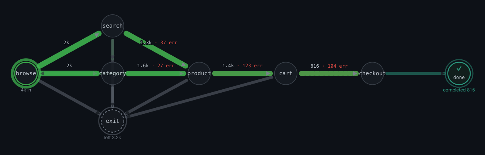
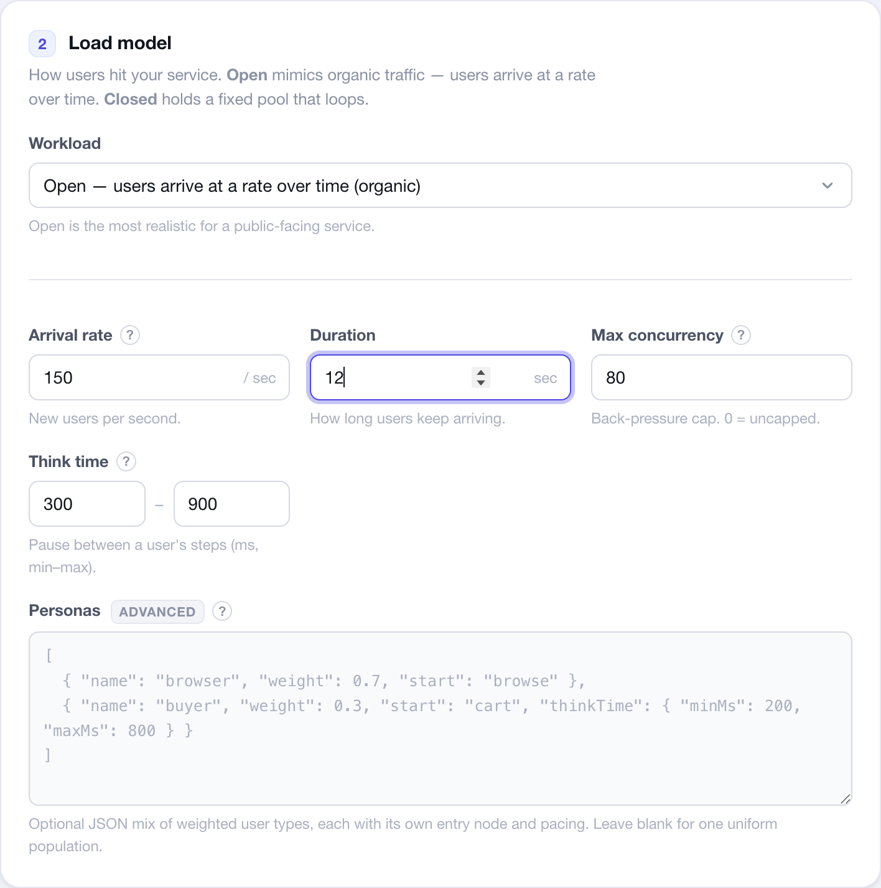
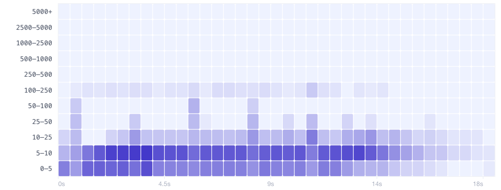

<h1 align="center">tmula</h1>

<p align="center">
  <b>A real-user traffic simulator - find the issues real users would hit, without recruiting them.</b><br>
  Drive virtual users through an explicit <i>behavior graph</i> against your API: they move like
  real people, deviate within the rules, and can swarm a single endpoint - surfacing bugs that
  plain load generation and manual testing miss.
</p>

<p align="center">
  📖 <b>User manual</b> - the full guide (concepts, every JSON field, CLI, findings, FAQ):
  <a href="docs/guide.en.md">English</a> · <a href="docs/guide.ko.md">한국어</a>
</p>

<p align="center">
  
  <br>
  <sub><i>Live traffic flow from a branching-shop run - edge thickness is request volume, and the red counts mark where the happy path broke (cart / checkout 5xx).</i></sub>
</p>

---

## What is tmula?

tmula is not trying to replace mature load-testing suites. Tools like k6, Locust, JMeter,
Gatling, Artillery, and nGrinder already cover scripting, scenarios, distributed execution,
dashboards, and CI in depth. **tmula** starts from a narrower angle: model the user journey
as an explicit **behavior graph**, then send virtual traffic through that graph to see where
the flow slows down, breaks, or concentrates.

Virtual users follow a journey, branch, hesitate, sometimes go off-script, and pile onto
whatever is hot. In tmula that journey is represented as nodes = API calls, weighted edges =
transitions, and dependency edges that are never skipped. It surfaces issues in three modes:

- **Scenario-following** - does the happy path hold up under realistic, branching traffic?
- **Deviation** - probabilistic skips, step reordering, and payload mutation (never violating a
  dependency) shake out the off-script bugs.
- **Load-concentration** - funnel virtual users onto one API and watch where it degrades.

Observation is **client-side first** (status codes, latency tails, and error / availability /
contract findings); server-side metrics are opt-in. A single Go binary with the web console baked
in runs **locally first** and **scales out** to distributed master/worker mode for large traffic.

> tmula는 기존 부하 테스트 도구를 대체하려는 도구가 아니라, **사용자 여정을 행동 그래프로 먼저
> 모델링하고** 그 흐름 위에서 부하와 실패를 관찰하기 위한 traffic simulation 도구입니다. 가상
> 사용자가 실제 사람처럼 시나리오를 따라 이동하고, 규칙 안에서 이탈하고, 특정 API에 부하를
> 집중시켜 - **실제 사용자를 모으지 않고도** 어디서 흐름이 느려지고, 실패하고, 몰리는지
> 확인합니다. 단일 Go 바이너리(웹 UI 내장)로 로컬에서 바로 돌리고, 필요하면 분산 마스터/워커로
> 확장합니다.

---

## Quickstart

Requirements: macOS / Linux. (Building from source needs Go 1.25+ and Node 20+.)

**Try it instantly (Docker)** - no Go/Node, no install. One command brings up the console (real UI
baked in) plus both example APIs, each with planted bugs:

```bash
git clone https://github.com/chordpli/tmula.git && cd tmula
docker compose up                    # builds on first run, then starts everything
```

Open <http://localhost:8080>, pick the **shop** or **ticketing** preset, then point it at the bundled
API: set **Base URL** to `http://sample-api:9000` (shop) or `http://ticketing-api:9100` (ticketing) and
add that host (`sample-api` / `ticketing-api`) to the **Allowlist**, then hit **Run**. Inside the
Compose network the engine reaches the SUTs by service name (not `localhost`), so both fields use it.

**Install it** - one line downloads a prebuilt single binary with the web UI baked in:

```bash
curl -fsSL https://raw.githubusercontent.com/chordpli/tmula/main/install.sh | sh
```

Then start the browser console, or run a scenario straight from the CLI:

```bash
tmula --role local --addr :8080      # open http://localhost:8080
tmula run scenario.yaml              # run a scenario, print the findings
```

**Or build from source** - needs Go + Node:

```bash
git clone https://github.com/chordpli/tmula.git && cd tmula
make demo                            # UI + engine + both example APIs, all locally
make web                             # just the console on :8080
# CLI only (fast, placeholder UI):   make build
```

With `make demo` the presets work as-is - they target `localhost:9000` / `:9100`, which the bundled
shop and ticketing APIs serve. Ctrl-C stops all three.

**Or just watch it find bugs** - one command, a sample API with planted bugs:

```bash
./examples/run-demo.sh               # needs go, jq, curl
```

It starts a sample shop API (with deliberate bugs) + the engine, runs an experiment, and prints
the issues it found. See [`examples/`](examples/) for the full walkthrough.

---

## How virtual users behave

| Mode | What it does | Finds |
|------|--------------|-------|
| **Scenario-following** | Users walk the behavior graph by edge weight, honoring dependency edges | Whether the happy path survives realistic, branching traffic |
| **Deviation** | Probabilistic skips, step reordering, payload mutation - never breaking a dependency | Off-script bugs manual testing misses |
| **Load-concentration** | Funnel users onto a single API | Where it degrades or saturates under pressure |

Two workload models drive arrivals: **closed** (a fixed pool of looping users) and **open** (users
arrive at a rate over time, for organic concurrency). Open is the realistic default and takes an
optional persona mix. A safety layer (host **allowlist**, **rate cap**, **kill switch**) keeps a run
from escaping its target.

---

## Response data correlation

Later steps can reuse values returned by earlier steps. Add an `extract` map to a request-bearing
step (or API template): keys become session variables, values are JSON paths in the response body.
Those variables are then available in later `path`, `headers`, and `payloadTemplate` fields via
Go template syntax.

```yaml
target: http://localhost:9000
flow:
  - id: products
    request: GET /products
    extract:
      productId: items.0.id
  - id: cart
    request: POST /cart
    body: '{"productId":"{{.productId}}","qty":1}'
```

Each virtual user/session keeps its own extracted variables, so one user's product/cart IDs do not
bleed into another user's journey.

---

## Commands

The `tmula` CLI - one binary, no curl/jq, no separately running server:

| Command | What it does |
|---------|--------------|
| `tmula --role local\|master\|worker` | Serve the engine + embedded web console |
| `tmula run <scenario.yaml>` | Run a scenario and print findings - `--users`, `--open <rate> --for <s>`, `--fail-on-findings` (CI gate, exit 2 on issues) |
| `tmula run --target <url> --get\|--post <path>` | Single-endpoint quick run |
| `tmula init --from <openapi.yaml\|session.har\|access.log>` | Scaffold a scenario from an API spec or HAR recording - or **learn the behavior graph from an access log** (sessions, branch weights, drop-offs, think time) |

Build & run from source:

| Make target | What it does |
|-------------|--------------|
| `make web` | Build the React UI, embed it, run the console on :8080 |
| `make build` | Go binary only - fast, UI is a placeholder (CLI path) |
| `make dev` | UI hot-reload dev server (proxies `/api` to a running engine) |
| `make test` · `make lint` | Go unit tests · `go vet` + gofmt check |

Health check: <http://localhost:8080/healthz>.

---

## Web console - for PMs & designers, no command line

`make web` builds the React control-plane UI into the binary and serves it at
<http://localhost:8080>. Fill in the target, scenario, and load (virtual users / arrival rate /
personas), hit **Run**, and watch it live:

- a **Traffic flow** map of requests moving across your scenario, with completion / drop-off,
- a **latency heatmap** (time × latency band),
- findings, a standalone **HTML report**, **compare with previous run**, and read-only **share** links,
- a one-click **OpenAPI / HAR / access-log import** (logs go further: the branching graph is *learned* from real traffic) and scenario **presets**, in a bilingual UI (English / 한국어).

<p align="center">
  
  <br>
  <sub><i>Dial in the load - an open arrival rate (or a closed pool that loops), think time, and weighted personas, each able to start at a different node.</i></sub>
</p>

<p align="center">
  
  <br>
  <sub><i>The latency heatmap - request density by latency band (rows) over time (columns); most requests sit in the 0-10 ms bands with a thin tail.</i></sub>
</p>

> A plain `make build` / `go build` embeds only a placeholder page that tells you to run
> `make web`. The CLI needs no UI build at all.

---

## Example domains

Two complete, runnable demos make it clear how to point tmula at your own API - pick one as a
**preset** in the web console (it fills the scenario *and* the target) or run it from the CLI.

| Example | What it is | Planted bugs it surfaces |
|---------|-----------|--------------------------|
| **shop** - `server/examples/sample-api` (`:9000`) | A branching store journey: `browse → search / category → product → cart → checkout` | ~8% cart 500s, a checkout that degrades under load, product 404s, a search latency tail |
| **ticketing** - `server/examples/ticketing-api` (`:9100`) | A concert-seat purchase: `events → detail → seats → hold → pay` | Seat-contention 409s, a payment gateway that buckles in the on-sale rush, sold-out 404s |

Each ships a sample API server, a behavior graph + templates, and an importable **OpenAPI / HAR**
([`examples/imports/`](examples/imports)). Full reference - the **User manual**
([English](docs/guide.en.md) · [한국어](docs/guide.ko.md)); a hands-on 0→100 walkthrough:
[`examples/USAGE.md`](examples/USAGE.md).

---

## Architecture

A single Go binary (engine + load workers, with an embedded React control-plane UI). Local-first;
scales out to gRPC master/worker for large runs. Client-side observation is the core; server-side
metrics are opt-in.

```
server/                  Go backend module
server/cmd/tmula         entrypoint: serve (--role local|master|worker), run, init
server/internal/domain   core model: experiments, scenario graphs, virtual users, ...
server/internal/engine   scenario graph execution (dependency edges inviolable)
server/internal/load     virtual users, load profiles, protocol adapters
server/internal/workload open-model (arrival-rate) scheduler + capacity planning
server/internal/obs      observation collector, finding classification, mergeable summary
server/internal/safety   allowlist, rate cap, kill switch
server/internal/store    in-memory (local) + Postgres (distributed) persistence
server/internal/cluster  gRPC master/worker for distributed runs
server/internal/web      embedded React UI
server/proto             protobuf contracts for distributed workers
server/examples          Go sample API servers used by the demos
web/                     React + Vite control-plane UI
examples/                scenario files, imports, one-command demo, USAGE guide
```

---

## Requirements

- macOS / Linux for the prebuilt binary, **or** Go 1.25+ and Node 20+ to build from source
- `jq` + `curl` for the one-command demo
- Docker + Postgres - optional, only for the distributed-store integration test

## License

TBD.

---

<p align="center">
  Built by <a href="https://github.com/chordpli">chordpli</a>
</p>
