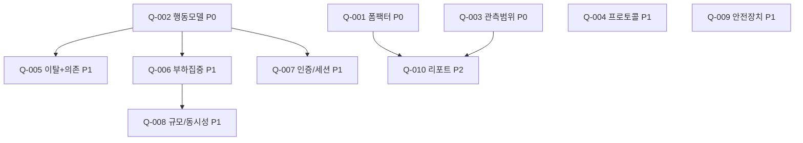

# Requirements: user-traffic-simulator

> Source: inline (사용자 자연어 요구사항, /pipeline new)

실 유저 없이도 "실제 사람처럼 행동하는 가상 유저"를 다수 생성해 대상 시스템(SUT)의
시나리오 동작 / 이탈 동작 / 부하 집중 상황을 재현하고, 거기서 발생하는 로그·에러·이슈를
찾아내는 트래픽 실험 엔진. ngrinder·k6 의 부하 생성 능력 + 행동 시뮬레이션을 결합.

대상 사용자: 실 유저 모집이 어려운 **개발자 / 기획자 / 디자이너**.

---

## 범위

- **가상 유저 N명 정의/선택** — 동시에 활동할 가상 유저 수를 지정.
- **API + payload 양식(템플릿) 입력** — 호출 대상 엔드포인트와 요청 본문 틀을 사용자가 등록.
- **행동 시뮬레이션** — 정의된 "틀(시나리오)" 안에서 가상 유저가 실제 사람처럼 여러 API를 순회·탐색하며 호출.
- **시나리오 이탈(랜덤 행동)** — 설정한 확률(%)로 비정상·예상외 행동을 섞되, **선행 의존성이 있는(프로세스가 있는) 작업은 건너뛰지 않음**(의존성 제약 준수).
- **부하 집중** — 특정 API에 트래픽을 의도적으로 몰리게 하는 설정(스파이크).
- **결과 수집·리포트** — 세 가지 모드(시나리오 준수 / 이탈 / 부하 집중) 각각에서 로그·에러·메트릭을 수집해, 동시성·가용성·스케일 한계·개발자가 놓친 에러를 드러냄.

## 비범위

> 원문이 *명시적으로* 제외한 항목은 거의 없음. 아래 1건만 명시적 제약이며, 나머지 경계는 오픈 질문(Q-001~Q-010)에서 확정한다.

- **의존성 무시한 작업 건너뛰기** — "프로세스가 있는 작업은 건너뛸 수 없음"이 명시됨. 즉 *선행 조건을 위반하는 형태의 랜덤 이탈*은 비범위(랜덤은 의존성 그래프를 존중해야 함). → Q-005에서 모델 확정.

---

## 오픈 질문

> **우선순위 요약: P0 3개 / P1 6개 / P2 1개.**
> P0(Q-001·Q-002·Q-003)는 다음 phase **product-brief** 를 막는다 — 최소 이 3개는 정해야 기획 브리프가 의미를 가짐.
> 각 카드의 `권장`은 근거(사실 인용 + 비채택 risk + 비대칭 + 본 작업 연결)를 갖췄거나, 50/50이면 `없음 + 잠금 해제 조건`으로 표기.
>
> **[2026-06-05 갱신 — spec-analyze S1]** Q-004~Q-010(P1/P2)의 *확정 결정*은 `02-tech-spec.md` AD-004~AD-013에 있다. 아래 카드의 `status: pending` 필드는 본 문서에 미동기화 — **P1 결정은 tech-spec AD 카드가 authoritative**. (매핑: Q-004→AD-004, Q-005→AD-005, Q-006→AD-006, Q-007→AD-009, Q-008→AD-007, Q-009→AD-008, Q-010→AD-010/리포트)

### Q-001 — 이 "플러그인"의 형태(form factor)는 무엇인가?
- blocks: `product-brief`
- priority: **P0**
- depends-on: —
- 근거: "플러그인"이라 했으나 비교 대상으로 든 ngrinder(웹 플랫폼)와 k6(CLI/코드)는 형태가 정반대다. 대상 사용자에 비개발자(기획자·디자이너)가 포함돼 조작 인터페이스가 결과를 가른다. 무엇에 붙는 "플러그인"인지(독립 도구인지, Claude Code/IDE 플러그인인지) 원문에 미확정.
- 옵션:

  | | 답변 | 장점 | 단점 | downstream 영향 |
  |---|---|---|---|---|
  | A | 독립 CLI + 설정파일(YAML) | 개발자 친화, 자동화/CI 쉬움 | 기획자·디자이너 접근 불가 | tech-spec: 단일 바이너리. product-brief 유저플로우: 코더 한정 |
  | B | 코어 엔진 + 웹 대시보드(GUI) | 3개 사용자군 모두 수용, ngrinder 선례 | 구축 비용 큼(프론트+백) | product-brief에 2개 유저플로우(운영자/뷰어). tech-spec: 서버+UI |
  | C | Claude Code / IDE 플러그인 | 기존 워크플로 안에 통합 | 비코더 배제, 호스트 종속 | tech-spec: 플러그인 SDK 종속 |
  | D | 라이브러리/SDK (테스트코드에 임베드) | 가장 가벼움 | 코더 전용, GUI 없음 | tech-spec: 패키지 배포만 |

- 권장: **B (코어 엔진 + 얇은 웹 UI)**
  - 근거: 원문이 대상 사용자를 "개발자, 기획자, 디자이너" 셋으로 *명시*했고 가치 제안이 "실 유저 없이 비전문가도 이슈를 찾는다"이다. A·C·D는 모두 코더 전용이라 명시된 3개 사용자군 중 2개(기획자·디자이너)를 *구조적으로 배제* — 가치 제안과 직접 충돌. 사용자가 직접 비교 대상으로 든 ngrinder가 정확히 이 이유로 웹 플랫폼이다. 코어/UI를 분리하면 개발자는 엔진을 CLI/CI로도 쓰고(A의 이점 흡수) 비코더는 UI로 접근 — 비대칭적으로 B가 우월. 본 작업의 ROI(비전문가의 셀프서비스 이슈 탐색)는 접근 가능한 UI 없이는 성립하지 않음.
  - 단, "플러그인"이 *문자 그대로 Claude Code 플러그인*을 뜻한다면 C로 전환됨 → 한 줄로 의도 확인 바람.
- status: **accepted** (B — 독립 웹 도구로 확정; Claude Code 플러그인 아님) — 2026-06-05

### Q-002 — 가상 유저의 "행동 모델"(=틀)을 어떻게 정의하는가?
- blocks: `product-brief`
- priority: **P0**
- depends-on: —
- 근거: "정해진 틀 안에서 실제 유저처럼 돌아다닌다"가 제품의 핵심이자 가장 모호한 부분. 틀을 *어떤 형식으로* 사용자가 기술하는지(그래프? 녹화? AI?)에 따라 제품·아키텍처가 완전히 달라짐.
- 옵션:

  | | 답변 | 장점 | 단점 | downstream 영향 |
  |---|---|---|---|---|
  | A | 명시적 상태 그래프(상태+전이확률+의존엣지) | 결정적, 확장 쉬움, 제약 표현 직관 | 사용자가 그래프 작성해야 함 | tech-spec: 그래프 실행엔진. Q-005·Q-006의 토대 |
  | B | 실트래픽 녹화→변형 재생(Markov 자동추출) | 진짜 행동분포 반영 | **녹화할 실유저가 없음**(전제 모순) | tech-spec: 캡처 파이프라인 필요 |
  | C | LLM 에이전트(유저별 LLM이 다음 행동 결정) | 가장 "사람 같음" | 수천 유저=수천 LLM콜→비용·지연 폭발, 비결정적 | tech-spec: LLM 오케스트레이션, 부하테스트와 상충 |
  | D | 가중 랜덤워크(API목록 + 의존선언) | 가장 단순 | 표현력 약함(상태/세션 빈약) | A의 경량판 |

- 권장: **A (명시적 상태 그래프), D를 경량 진입점으로 흡수**
  - 근거: 원문의 두 표현이 그래프 모델로 정확히 매핑된다 — "정해진 틀"=명시적 구조(상태·전이), "프로세스가 있는 작업은 건너뛸 수 없음"=필수 선행(precondition) 엣지. B는 *녹화할 실유저가 있어야* 하는데 본 도구의 존재 이유가 "실유저 모집이 어렵다"라 전제가 자기모순. C(유저당 LLM)는 goal #3(트래픽 몰림, 수천 동시)에서 콜 수·비용·지연이 선형 폭발해 부하 생성기로 부적합 — "사람다움"의 이득은 인프라/동시성 버그 탐색이라는 본 목적과 무관. A는 사용자가 그래프를 작성하는 초기 비용이 있으나 결정적·확장가능·제약을 1급으로 표현 → goal #1~#3 전부에 비대칭적으로 부합. (C는 후속 "고충실도 모드"로 보류)
- status: **accepted** (A — 명시적 상태 그래프; D를 경량 진입점으로 흡수) — 2026-06-05

### Q-003 — 관측(observation) 범위는 어디까지인가? "이슈"를 무엇으로 판정하나?
- blocks: `product-brief`
- priority: **P0**
- depends-on: —
- 근거: goal #3(서버다운·가용성·스케일)과 #4(개발자가 놓친 에러)를 *측정 가능하게* 만들려면 무엇을 관측하는지부터 정해야 함. 클라이언트 신호만으로 충분한지, 서버측 계측이 필수인지가 성공지표(product-brief)를 좌우.
- 옵션:

  | | 답변 | 장점 | 단점 | downstream 영향 |
  |---|---|---|---|---|
  | A | 클라이언트측만(status·지연·에러율·응답 assertion) | 셋업 0, 어떤 SUT에도 즉시 | 근본원인(서버 내부)은 추론만 | tech-spec: 수집기 단순. product-brief 성공지표=증상 기반 |
  | B | 클라이언트 + 서버측 메트릭 풀(Prometheus/OTel/APM/로그) | 근본원인까지, 스케일 동작 직접 관측 | SUT 계측 배선 필요, 비코더 진입장벽 | tech-spec: 통합 어댑터 다수 |
  | C | 클라이언트 + 경량 서버 에이전트/사이드카 | 중간 깊이 | 배포 부담 | tech-spec: 에이전트 빌드 |

- 권장: **A(필수 코어) + B(opt-in 레이어)**
  - 근거: goal #3·#4의 *증상*은 클라이언트에서 충분히 잡힌다 — 지연 급상승·5xx·timeout·에러율 상승은 가용성 저하/서버 포화의 직접 신호. 순수 B(서버측 선행 배선 필수)는 자기 SUT를 계측 못 하는 기획자·디자이너와, 통제권 없는 외부 SUT를 *구조적으로 배제* → Q-001에서 본 3개 사용자군 수용 결정과 충돌. 따라서 클라이언트측을 무조건 코어로 깔아 전원 즉시 사용 가능하게 하고, 서버측은 *근본원인이 필요할 때 더하는 가산 가치*로 둠 — 비대칭(클라만으로도 v1 가치 성립, 서버측은 없어도 안 막힘). 본 작업 v1의 "이슈를 찾아낸다"=증상 표면화, 심층 원인은 후속 레이어.
- status: **accepted** (A 코어 필수 + B opt-in 서버측 메트릭 레이어) — 2026-06-05

### Q-004 — 대상 프로토콜 범위는?
- blocks: `tech-spec`
- priority: P1
- depends-on: —
- 근거: "API와 payload"는 REST를 시사하나 명시 안 됨. 프로토콜이 클라이언트 부하생성 복잡도를 가름.
- 옵션:

  | | 답변 | 장점 | 단점 | downstream 영향 |
  |---|---|---|---|---|
  | A | HTTP/REST 전용 | v1 범위 명확, 구현 단순 | 실시간/스트리밍 불가 | tech-spec: HTTP 클라이언트 1종 |
  | B | REST + GraphQL | GQL 백엔드 수용 | 쿼리 변형 로직 추가 | tech-spec: GQL 어댑터 |
  | C | + gRPC / WebSocket / SSE | 실시간 시스템 커버 | 스트리밍 동시성 모델 별도 | tech-spec: 프로토콜별 부하엔진 |

- 권장: **A (HTTP/REST 전용, v1)**
  - 근거: 원문이 "API와 payload 양식"이라는 전형적 REST 프레이밍만 제시하고 스트리밍·실시간 언급이 0. C는 gRPC/WS마다 별도 부하생성·스트리밍 동시성 모델이 필요해 *검증 안 된 수요*에 클라이언트 복잡도를 배가 — v1 범위를 흐림. REST로 시작해 구체적 SUT가 다른 프로토콜을 요구할 때 어댑터로 확장하는 편이 비대칭적으로 유리(지금 든 모든 예시를 A가 커버).
- status: pending

### Q-005 — 랜덤 이탈 모델 + 의존성 제약을 어떻게 정의하나?
- blocks: `tech-spec`
- priority: P1
- depends-on: Q-002
- 근거: "몇 % 확률로 랜덤" + "프로세스 있는 작업 건너뛰기 금지"를 양립시키는 규칙이 필요. 이탈이 *무엇을* 바꾸는지(순서? 생략? 잘못된 입력?)가 goal #2·#4의 산출을 결정.
- 옵션:

  | | 답변 | 장점 | 단점 | downstream 영향 |
  |---|---|---|---|---|
  | A | 선택 단계 생략 + 독립 단계 재정렬 + 플로우 이탈(의존엣지는 불가침) | 제약 안전, 단순 | 입력검증 버그는 못 찾음 | tech-spec: 그래프 워커 규칙 |
  | B | A + payload 변형/경계값/악의 입력 주입(퍼징-라이트) | goal #4(놓친 에러) 직격 | 오탐 관리 필요 | tech-spec: 변형 엔진 + 판정 |
  | C | 완전 카오스(의존 무시 무작위 호출) | 가장 거침 | **원문 제약 위반**(프로세스 건너뜀) | 비범위 |

- 권장: **B (A + 입력 변형 주입)**
  - 근거: 원문 제약("의존성 있는 작업 건너뛸 수 없음")이 C를 명시적으로 배제하므로 의존엣지는 불가침으로 고정(A 기반). 그런데 goal #4 "개발자가 놓친 부분 에러"는 *정상 순서로는* 안 나오고 주로 예상외 입력값(경계·타입·누락 필드)에서 터지므로, 순서만 흔드는 순수 A로는 goal #4가 미달. B의 payload 변형이 바로 "개발자가 놓친 에러"가 숨는 지점을 친다 → goal #2(이탈)·#4를 동시에 충족하는 비대칭 선택. (C는 원문 위반이라 후보 아님)
- status: pending

### Q-006 — 부하 집중("몰리게")을 어떤 단위로 지정하나?
- blocks: `tech-spec`
- priority: P1
- depends-on: Q-002
- 근거: "특정 API에 막 몰리게"의 정량 단위가 미정. 절대 RPS인지 상대 가중인지에 따라 부하 엔진·스케줄러가 달라짐.
- 옵션:

  | | 답변 | 장점 | 단점 | downstream 영향 |
  |---|---|---|---|---|
  | A | API별 가중치 배수(상대) | 서버 한계 몰라도 지정 가능 | 절대 RPS 보장 안 됨 | tech-spec: 가중 스케줄러 |
  | B | API별 절대 목표 RPS | 정밀 | **서버 용량을 미리 알아야**(그게 미지) | tech-spec: RPS 컨트롤러+백프레셔 |
  | C | 가상유저 %를 특정 API로 깔때기 | 행동모델과 자연 결합 | 순간 스파이크 표현 약함 | tech-spec: 유저 분배 |
  | D | 명명된 hotspot + 램프 프로파일(spike/ramp/soak) | goal #3 스케일테스트 직격 | 설정 항목 증가 | tech-spec: 시계열 부하 |

- 권장: **A + D (가중 배수 + 램프 프로파일)**
  - 근거: 원문 "특정 api 설정해놓으면 막 몰리게"=상대적 강조(A)이고, goal #3이 "스케일 업/아웃"을 요구하는데 이는 점진 증가(ramp)와 급증(spike) 같은 *시간축 형태*(D) 없이는 관측 불가. B(절대 RPS)는 사용자가 서버 용량을 미리 알아야 하는데 그 한계를 *찾는 것*이 본 도구의 목적이라 전제가 어긋남 — 비대칭적으로 A+D가 "한계를 모른 채 한계를 미는" 본 작업에 부합.
- status: pending

### Q-007 — 인증/세션을 어떻게 처리하나?
- blocks: `tech-spec`
- priority: P1
- depends-on: Q-002
- 근거: "실제 유저처럼" 움직이려면 대개 로그인/토큰/세션이 필요. 가상 유저별 인증 처리 방식이 미정.
- 옵션:

  | | 답변 | 장점 | 단점 | downstream 영향 |
  |---|---|---|---|---|
  | A | 사전 발급 토큰/계정 풀(사용자가 N개 공급) | 단순, 로그인 부하 배제 | 로그인 경로 자체는 테스트 못 함 | tech-spec: 토큰 주입기 |
  | B | 로그인 플로우를 시나리오 노드로(유저별 로그인) | 로그인 경로도 검증 | 매 런 로그인 비용·rate limit | tech-spec: 로그인 핸들러 |
  | C | 플러그형 인증 공급자(A·B 모두) | 양쪽 수용 | 설정 표면 증가 | tech-spec: auth 어댑터 인터페이스 |

- 권장: **C (플러그형, 토큰 풀을 기본값)**
  - 근거: 인증은 *때로는 테스트 대상(B)*이고 *때로는 노이즈(A)*라 한쪽으로 고정하면 한 부류 사용자가 막힘 — 순수 A는 로그인 엔드포인트를 영영 못 치고, 순수 B는 모든 런이 로그인 비용을 물고 rate limit에 걸림. 플러그형으로 두고 토큰 풀을 기본값으로 깔면 v1은 단순하게 출발하되 로그인이 의존엣지(Q-005)인 시나리오에서 B로 끼울 수 있음.
  - 단, *기본을 A로 둘지 B로 둘지*는 "로그인 자체가 테스트 대상인가"라는 사용자별 사실에 달림 → 잠금 해제: "로그인 경로도 부하 대상에 포함하나?" 1줄.
- status: pending

### Q-008 — 목표 규모/동시성 수준은?
- blocks: `tech-spec`
- priority: P1
- depends-on: Q-006
- 근거: "몇 명의 유저를 선택"(소규모 뉘앙스)과 "트래픽 몰림→서버다운·스케일아웃"(대규모 뉘앙스)이 충돌. 규모가 아키텍처(단일 프로세스 vs 분산)를 근본적으로 가름.
- 옵션:

  | | 답변 | 장점 | 단점 | downstream 영향 |
  |---|---|---|---|---|
  | A | 소규모(≤100, 단일 프로세스 async) | 가장 단순 | goal #3(서버 포화)을 못 일으킴 | tech-spec: 단일 노드 |
  | B | 중규모(수백~수천, 단일 강력 노드 async+워커풀), 수평확장 가능 설계 | 부하 시연 + 과설계 회피 | 초대형은 후속 | tech-spec: 무상태 워커, 스케일아웃 여지 |
  | C | 대규모(1만+, 분산 워커/k8s) | 진짜 대량 | 엔진 검증 전 인프라 선투자 | tech-spec: 분산 코디네이터 |

- 권장: **B (단일 노드 async, 수평 확장 가능 설계)**
  - 근거: A는 동시성이 낮아 goal #3(서버다운·가용성)을 *유발조차 못 함* → 핵심 목적 미달. C(분산)는 엔진이 검증되기 전 코디네이션 인프라를 선투자해 과설계. B(단일 노드로 수백~수천, 단 워커를 무상태로 설계해 C는 *재작성 아닌 설정 확장*)가 "한계를 밀어 보이되 과하지 않은" 골디락스. "몇 명 선택"이 수백만은 아니라는 신호와도 정합.
  - 단, *구체적 피크 동시 유저/RPS 수치*가 단일 노드로 충분한지를 최종 확정 → 잠금 해제: 목표 피크(예: "동시 2,000명" 또는 "초당 5,000 요청") 1개.
- status: pending

### Q-009 — 대상 환경 안전장치(특히 prod 보호)는?
- blocks: `tech-spec`
- priority: P1
- depends-on: —
- 근거: 본 도구는 *의도적으로 트래픽을 몰아 시스템을 포화*시킨다(goal #3). 오발사 시 그대로 DoS가 됨. 회사 정책 §1(prod 변경 절차)·§5.2(prod 테스트 금지)와 직접 충돌 위험.
- 옵션:

  | | 답변 | 장점 | 단점 | downstream 영향 |
  |---|---|---|---|---|
  | A | dev/staging 기본 + 대상 호스트 화이트리스트 + 하드 rate cap + kill switch 필수 | 오발사 방지 | 약간의 설정 | tech-spec: 가드 레이어 1급 |
  | B | prod 포함 임의 대상 + 명시 확인 | 유연 | §1 절차 우회 유혹 | tech-spec: 확인 게이트만 |
  | C | 가드 없음(사용자 책임) | 가장 자유 | 실수=prod 장애 | tech-spec: 없음 |

- 권장: **A (dev/staging 기본 + 필수 가드)**
  - 근거: 정책 §1은 prod 영향 변경에 티켓+롤백+영향분석을 요구하고 §5.2는 prod 테스트를 금지한다. 트래픽을 *일부러 몰리게* 하는 도구가 prod를 기본 허용하면(B/C) 단 한 번의 오타로 자기 손으로 prod 장애를 만든다 — 본 도구 특성상 blast radius가 곧 도구의 핵심 기능. 화이트리스트+rate cap+kill switch는 구축 비용이 작고 파국을 막아 비대칭적으로 A가 우월. prod 대상이 정말 필요하면 §1 트라이어드를 갖춘 명시적 잠금 해제로만 허용.
- status: pending

### Q-010 — 결과 산출물(리포트)의 형태는?
- blocks: `qa-plan`
- priority: P2
- depends-on: Q-001, Q-003
- 근거: "이슈를 찾아낸다"의 최종 전달물 형태가 미정. 단 Q-001(폼팩터)·Q-003(관측)에 종속이라 그 뒤 자연 결정됨.
- 옵션:

  | | 답변 | 장점 | 단점 | downstream 영향 |
  |---|---|---|---|---|
  | A | 런 종료 후 구조화 리포트(HTML/JSON) | 폼팩터 무관, 공유 쉬움 | 실시간성 없음 | qa-plan: 리포트 스키마 |
  | B | 런 중 라이브 대시보드 | 즉시 관측, 부하 중 반응 | 웹 UI 전제(Q-001=B) | qa-plan: 스트리밍 지표 |
  | C | A+B + 이슈 트래커(Linear 등) 자동 등록 | 발견→티켓 자동화 | 통합 비용 | qa-plan: 트래커 연동 |

- 권장: **A 기본 + (Q-001이 B면) 라이브 뷰 추가**
  - 근거: 구조화 리포트(A)는 폼팩터·관측범위와 무관하게 항상 성립하는 최소 공통분모라 어떤 Q-001 결정에도 안전. 라이브 대시보드(B)는 Q-001이 웹 UI(B)일 때만 자연스러우므로 그 결정에 종속시켜 결정 — 본 카드 단독으로 확정할 필요 없음(그래서 P2). C(트래커 자동 등록)는 가치 있으나 v1 필수는 아님.
- status: pending

---

## 결정 의존성 그래프

- Q-005·Q-006·Q-007 ← Q-002 (행동모델이 정해져야 이탈/부하/인증 규칙을 그 위에 얹음)
- Q-008 ← Q-006 (부하 지정 단위가 규모 요구를 좌우)
- Q-010 ← Q-001, Q-003 (폼팩터·관측이 정해지면 리포트 형태는 자연 결정 → 그래서 P2)
- P0 3개(Q-001·Q-002·Q-003)는 서로 독립 → 한 번에 답변 가능
